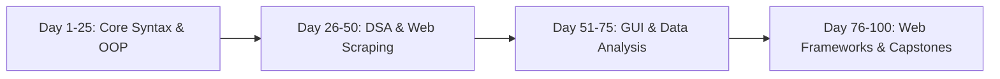

<div align="center">

# 🐍 100 Days of Python Challenge

<p align="center">
  <strong>From Beginner to Advanced: Algorithmic Problem Solving & Daily Coding Projects</strong>
</p>

<p align="center">
     
</p>

<p align="center">
  <a href="#-overview">Overview</a> •
  <a href="#-system-architecture">Architecture</a> •
  <a href="#-key-features--capabilities">Key Features</a> •
  <a href="#-tech-stack--tools">Tech Stack</a> •
  <a href="#-quick-start">Quick Start</a> •
  <a href="#-author--license">Author</a>
</p>

</div>

---

## 📌 Overview

A complete repository documenting 100 consecutive days of hands-on Python development, data structures, algorithms, automation scripts, GUI applications, and web services.

---

## 🏗️ System Architecture



---

## ✨ Key Features & Capabilities

- 🧩 **Foundational Mastery**: Control flow, data types, functional programming, and object-oriented patterns.
- ⚙️ **System Automation**: File I/O, regex, web scraping with BeautifulSoup, and API consumption.
- 🤖 **Interactive Applications**: Desktop GUI apps (Tkinter), data analysis (Pandas/NumPy).
- 🚀 **Capstone Projects**: Full-stack web utilities, web bots, and algorithmic solvers.

---

## 🛠️ Tech Stack & Tools

- **Python 3**
- **Algorithms**
- **OOP**
- **APIs**
- **Web Scraping**
- **Automation**

---

## 🚀 Quick Start

### 📋 Prerequisites
Ensure you have the required runtime environment installed:
* **Git** version 2.30+
* **Python 3.9+** / **Node.js 18+** / **Android Studio** (depending on project stack)

### 📥 Installation & Setup

```bash
# 1. Clone the repository
git clone https://github.com/muhammadokashapak/100_Days__Python_challenge-.git

# 2. Enter the directory
cd 100_Days__Python_challenge-
```

---

## 👨‍💻 Author & License

<div align="center">

**Muhammad Okasha**
<br/>
*Deep Learning & Mobile Software Engineer*
<br/><br/>
<a href="https://github.com/muhammadokashapak"></a>
<a href="https://linkedin.com/in/muhammad-okasha"></a>
<a href="mailto:muhammadokashapak@gmail.com"></a>

<br/><br/>

*⭐️ If you find this project helpful, please consider giving it a star! • © 2026 [Muhammad Okasha](https://github.com/muhammadokashapak)*

</div>
